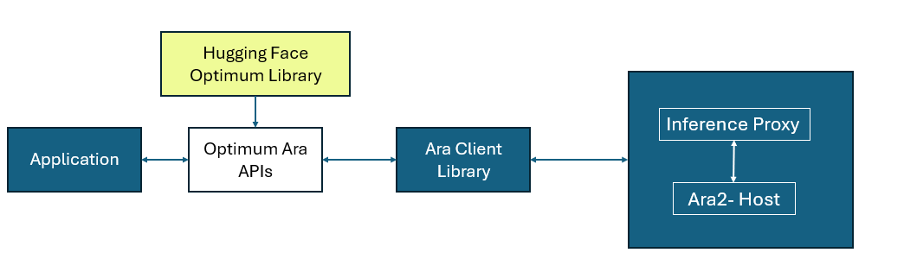

<div align="center">

# Optimum Ara

[](https://www.python.org/downloads/release/python-31013/)
[](LICENSE.txt)

---
<div align="left">

## Table of Contents

- [Optimum Ara](#optimum-ara)
  - [Table of Contents](#table-of-contents)
  - [Supported Models](#supported-models)
  - [Prerequisite](#prerequisite)
  - [Install Optimum Ara from Source](#install-optimum-ara-from-source)
  - [Generate Wheel Package](#generate-wheel-package)
  - [Set up Optimum Ara in i.MX Platforms](#set-up-optimum-ara-in-imx-platforms)
  - [Run Example with Optimum-Ara](#run-example-with-optimum-ara)
  - [API Documentation](#api-documentation)
  - [Examples](#examples)
  - [License](#license)

---

Optimum Ara is an extension of the [Hugging Face Transformers](https://huggingface.co/docs/transformers/index) and Optimum ecosystem that adds support for the Ara DNPU, enabling high-performance AI inference at the edge. It provides Python APIs that mirror familiar Transformers patterns, such as `AutoModelForCausalLM`, `AutoModelForImageTextToText`, and related classes, while offloading model execution to Ara hardware through compiled .dvm model binaries.

By importing `optimum.ara`, Ara DNPU specific model and configuration classes are registered with Transformers auto-classes. The library then manages session creation, endpoint communication, and generation, allowing applications to run optimized inference with minimal changes to standard Hugging Face workflows.

## Supported Models

The following models are integrated into the `optimum-ara` library:

| Model                   | Variants           | model_type          |
| :---------------------- | :----------------- | :------------------ |
| Llama 2                 | 7B                 | ara_llama           |
| Llama 3.1               | 8B                 | ara_llama           |
| Qwen 2                  | 7B                 | ara_qwen            |
| Qwen 2.5                | coder-1.5B, 3B, 7B | ara_qwen            |
| Qwen 2.5 Image          | 3B, 7B             | ara_qwen_image      |
| Qwen 2.5 VL             | 3B, 7B             | ara_qwen_vl         |
| Qwen2.5-VL (multimodal) | 3B, 7B             | ara_qwen_multimodal |



## Prerequisite

> Note: Please make sure you have the Ara DNPU Runtime software stack installed and configured on your system before proceeding with the installation of Optimum Ara. Ara240 DNPU module must also be connected to your platform.

1. Configure the Ara Runtime by setting the SDK root directory. If you are using an i.MX platform that already has the Ara DNPU Runtime software stack pre-installed, this step is not required and you can skip to [Set it up in i.MX Platforms](#set-it-up-in-imx-platforms) section. Otherwise, set the environment variable:

    ```bash
    export DV_TGT_ROOT=<sdk root path>
    ```

2. Start the Ara DNPU proxy:

    ```bash
    # For x86 platforms:
    cd $DV_TGT_ROOT/art/linux/x86/proxy/
    # For aarch64 platforms:
    cd $DV_TGT_ROOT/art/linux/aarch64f/proxy/

    # Run the proxy
    ./proxy -c ../../config/proxy_config.yaml
    ```

## Install Optimum Ara from Source

> Note: Python Virtual Environment is recommended to avoid conflicts with exisiting packages.

Clone this repository in your target platform. You can choose the version to download. We recommend using `uv` for ease of use and faster installation than `pip`. To install `uv`, follow steps from [Installation | uv](https://docs.astral.sh/uv/getting-started/installation/):

```bash
# Below command fetches Optimum Ara v1.0.0. Change this version depending on the SDK you are using
git clone https://github.com/NXP/Optimum-Ara.git -b v1.0.0
cd optimum-ara

# Create venv using uv:
uv venv

# To install for usage
uv pip install .
# To install for development
uv pip install -e .
```

## Generate Wheel Package

1. The following commands will generate a wheel package in the `./dist` directory. You can install the wheel package on your target platform if Git is not available (such is the case of default i.MX BSP):

    ```bash
    uv venv
    uv build
    ```

2. Copy the wheel package to the platform you want to use and install it there with below command:

    ```bash
    # Make sure you have uv installed in the platform, or use pip instead
    uv venv
    uv pip install optimum_ara-<version>.whl
    ```

## Set up Optimum Ara in i.MX Platforms

Optimum-Ara and Ara DNPU Runtime software stack is part of the official i.MX Embedded Linux BSP starting `LF6.18.20_2.0.0` (June 2026). Please check the Release Notes to see which i.MX platforms are supported. If you want to install the included Optimum-Ara wheel in your i.MX platform, follow the instructions below:

1. Flash the BSP to an i.MX platform that officially supports Ara240 DNPU. To get the officially released pre-built BSPs go to: [Embedded Linux for i.MX Applications Processors | NXP Semiconductors](https://www.nxp.com/design/design-center/software/embedded-software/i-mx-software/embedded-linux-for-i-mx-applications-processors:IMXLINUX). If you want to build your own BSP, please follow the instructions in [i.MX Yocto Project User's Guide](https://www.nxp.com/docs/en/user-guide/UG10164.pdf). To flash the BSP, follow the instructions in [i.MX Linux User's Guide](https://www.nxp.com/docs/en/user-guide/UG10163.pdf).

2. Ensure the Ara DNPU module is connected to the i.MX platform through PCIe M.2 or USB. Boot up the board and wait for the Ara DNPU proxy is up and running. You should see below logs:
   
   ```plain
    [74.657320] bash[1135]: 2026-03-13 15:36:17 - Proxy launched succesfully
    [75.689777] bash[1143]: 2026-03-13 15:36:18 - Hardware bringup completed and proxy is launched successfully in the background.
   ```

3. The pre-built wheel binary is located at `/usr/share/python-wheels/`. Name of wheel will change depending on the version of Optimum-Ara included in the BSP.

4. Install Optimum-Ara. Make sure your i.MX platform has access to internet, and its date and time are correct. Otherwise, it will fail to fetch scripts from servers due to SSL certificate issues. It is recommended to install Optimum-Ara in a virtual environment. We recommend using uv, but native python venv is also supported. Below are steps using uv. Please ensure you add the `--no-progress` argument for faster installation:

    ```bash
    # Use curl to download uv script and execute with sh:
    curl -LsSf https://astral.sh/uv/install.sh | sh
    # Run below command to be able to use uv without restarting your shell:
    source $HOME/.local/bin/env

    # Create your venv
    uv venv
    # Install Optimum-Ara
    uv pip install --no-progress /usr/share/python-wheels/optimum_ara-1.0.0-py3-none-any.whl
    ```

## Run Example with Optimum-Ara

This section shows you how to run an example using Optimum-Ara after installation. THis example uses `Qwen2.5-Coder-1.5B` model, fetched from [nxp/Qwen2.5-Coder-1.5B-Ara240](https://huggingface.co/nxp/Qwen2.5-Coder-1.5B-Ara240).

1. Fetch the model from Hugging Face:

    ```bash
    uv run hf download nxp/Qwen2.5-Coder-1.5B-Ara240 --local-dir /usr/share/llm/Qwen2.5-Coder-1.5B
    ```

2. Create a Python script with below example code. You can name it something like `qwen2_5_coder_1.5b.py`:

    > Note: You might need to change the `MODEL_PATH` and `TOKENIZER_PATH` to match your setup. This one works on i.MX platforms with the default BSP setup.

    ```python
    # Copyright 2026 NXP
    # SPDX-License-Identifier: Apache-2.0

    import os
    import sys

    from transformers import Qwen2TokenizerFast, AutoModelForCausalLM
    import optimum.ara
    from transformers import TextStreamer

    MODEL_PATH = os.path.realpath("/usr/share/llm/Qwen2.5-Coder-1.5B")
    TOKENIZER_PATH = "/usr/share/llm/Qwen2.5-Coder-1.5B/tokenizer"

    INPUT_PROMPT = "Write a Python script that computes the factorial of a number."

    tokenizer = Qwen2TokenizerFast.from_pretrained(TOKENIZER_PATH)
    model = AutoModelForCausalLM.from_pretrained(MODEL_PATH)

    messages = [
        {"role": "system", "content": "You are a helpful python coding assistant."},
        {"role": "user", "content": INPUT_PROMPT},
    ]

    inputs = tokenizer.apply_chat_template(
        conversation=messages, tokenize=False, add_generation_prompt=True
    )
    inputs = tokenizer(inputs, return_tensors="pt")
    streamer = TextStreamer(tokenizer, stream=sys.stdout)

    print("\n" + "=" * 50)
    print("USER PROMPT:")
    print("=" * 50)
    print(INPUT_PROMPT)
    print("=" * 50 + "\n")

    output = model.generate(**inputs, streamer=streamer, max_new_tokens=256)

    del model
    ```

3. Run the example with below command:

    ```bash
    uv run qwen2_5_coder_1.5b.py
    ```

    ```plain
    [2026-07-14 17:11:03] [INFO] [modeling_base.py:_get_llm_dvm_path] Found dvm_file, /usr/share/llm/Qwen2.5-Coder-1.5B/model.dvm
    [INFO] - DVAPI: loaded dvinfclient lib: /usr/lib/libaraclient_aarch64.so
    [2026-07-14 17:11:03] [INFO] [modeling_base.py:_handle_device_map] Model size: 1.73 GB, Additional required memory: 600.00 MB
    [2026-07-14 17:11:03] [INFO] [modeling_base.py:_handle_device_map] Total size required for Model: 2.32 GB
    [2026-07-14 17:11:03] [INFO] [modeling_base.py:_handle_device_map] Endpoint : 0 has free space : 15.77 GB
    I:DVPULB[260714171103] model type is ara2 llm
    I:DVPULB[260714171103] Successfully read llm_params_t from model file
    I:DVPULB[260714171103] model found to be dyn quant v2 model

    ==================================================
    USER PROMPT:
    ==================================================
    Write a Python script that computes the factorial of a number.
    ==================================================

        ```python
        def factorial(n):
            # Base case: factorial of 0 or 1 is 1
            if n == 0 or n == 1:
                return 1
            # Recursive case: n * factorial of (n-1)
            else:
                return n * factorial(n-1)

        # Example usage
        number = int(input("Enter a number to calculate its factorial: "))
        result = factorial(number)
        print(f"The factorial of {number} is {result}")
        ```

    In this solution, the `factorial` function calculates the factorial of a given number `n`. The function uses recursion to multiply each number from `n` down to `1`, effectively computing the product. The base cases are when `n` is either 0 or 1, in which case it returns 1. For all other values of `n`, it calls itself with `n-1`, multiplying the result by the current value of `n`. This recursive approach allows us to efficiently compute factorials without explicitly looping through all numbers up to and including that value.<|im_end|>
    ```

## API Documentation

Optimum Ara provides configuration and model classes inspired by Hugging Face Transformers.

For more info check [api documentation](./docs/optimum-ara-apis.md)

## Examples

Examples provide a quick way to start using Optimum Ara.

For more info check [example readme](./examples/Readme.md)

## License

Optimum Ara is licensed under the [Apache-2.0](LICENSE.txt) license.
